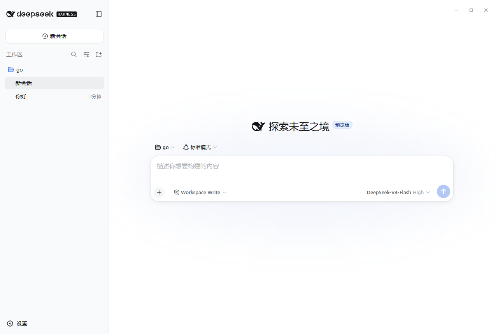
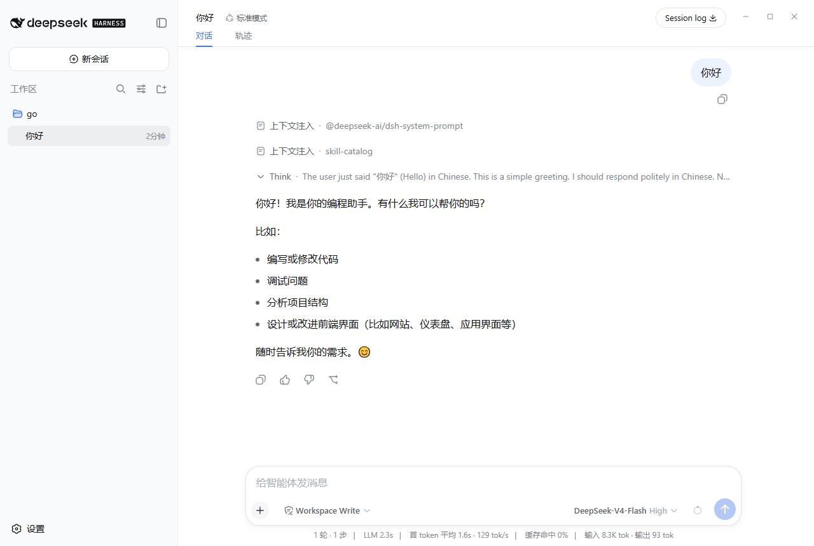
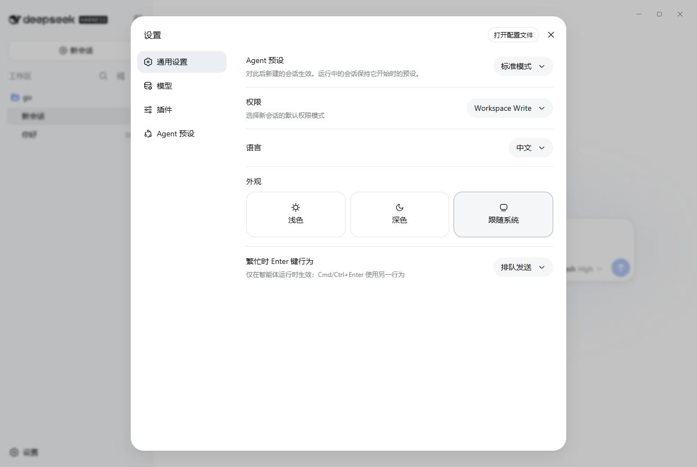

# deepseek-harness-desktop

[中文](README.md) | English

A DeepSeek Harness desktop client for Windows and macOS. Double-click to start, with no terminal and no browser tab.

## Overview

DeepSeek Harness is a plugin-based agent runtime: the agent loop, shells and terminals, a write-restricted sandbox, filesystem tools, web search, skills, subagents, and workflows, all orchestrated by one process.

This project delivers it as a desktop application. The interface, the capabilities, and the data format match upstream; what disappears is the sequence of installing a Node toolchain, building, running a command, and opening a browser.







## Install

Download the installer for your platform from [Releases](https://github.com/cloud-1104/deepseek-harness-desktop/releases):

| Platform | File |
|---|---|
| Windows x64 | `.exe` (NSIS installer) |
| macOS Apple Silicon | `-arm64.dmg` |
| macOS Intel | `-x64.dmg` |

It runs as installed; no separate Node or other runtime is required. On first launch, enter an API key on the Models page to start a conversation.

Current releases are unsigned: Windows shows a SmartScreen prompt on first run, and macOS needs a one-time approval under System Settings, Privacy and Security.

## Build from source

Requires Node `^22.19 || >=24` and pnpm 11.

```sh
pnpm install
pnpm run build
pnpm run desktop:prepare
pnpm run desktop:dev
```

To build installers:

```sh
pnpm run desktop:dist
```

Artifacts land in `apps/desktop/release/`. Native addons are compiled per platform, so the Windows installer has to be built on Windows and the macOS disk images on macOS. [apps/desktop/README.md](apps/desktop/README.md) describes the shell's structure and its packaging pipeline.

## Data and configuration

Sessions, credentials, and settings live in the harness home directory (`$DSH_HOME`, `~/.dsh` by default), shared with the command-line version, so each side sees the other's history.

Workspaces are added inside the UI and do not depend on a launch directory. The desktop app keeps only its backend log under the application data directory.

## Known limitations

- The installers are unsigned and need a one-time approval on first run. An unsigned macOS build also cannot update itself; it reports a new version and opens the download page.
- Windows arm64 and Linux builds are not provided yet.
- Shell tooling on Windows goes through PowerShell, which must be present on the machine.
- Live `cordis.patch.yml` reloading is unavailable on the desktop; configuration changes apply on the next launch.
- The backend child runs under the app's own executable name. Closing the window leaves nothing behind, but killing the app (Task Manager, a crash, or an installer's close-the-app step) can outlive it and make the next install report that it cannot close the application. Run `taskkill /IM "DeepSeek Harness Desktop.exe" /F` and retry.

## Acknowledgements

Built on [DeepSeek Harness](https://github.com/deepseek-ai/deepseek-harness), whose commit history this repository keeps. Every runtime capability comes from upstream.

## License

MIT.
